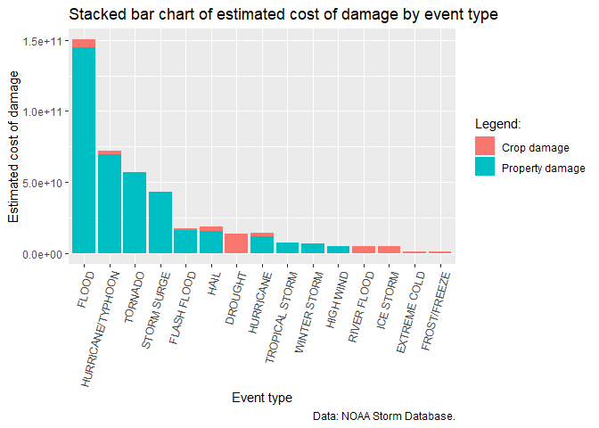

Richard D. Wilkinson
03/11/2020

# Analysis of NOAA storm event data

*Second assignment for the [‘Reproducible
Research’](https://www.coursera.org/learn/reproducible-research)
Coursera course.*

## Synopsis

This report analyses data from the NOAA storm database in order to provide tentative answers to two questions: 
1. Which types of storm events are most harmful to population health
2. Which types of storm events have the greatest economic consequences?

After noting some of the datasets’ limitations (e.g., crop damage estimates only from 1993 onward, discrepances in damage estimates, incoherent storm types), this report shows on the one hand that “tornados”, “excessive heat” and “TSTM wind” were the worst storm types in terms of population health impacts. On the other hand, “floods”, “tornados” and “storm surges” were the three most catastrophic storm types in terms of estimated damage costs (property and crop damage).

## Data processing

### Pre-processing

Check if the dataset is already available in the adequate folder,
otherwise create this and download it.

``` r
if (!dir.exists(file.path("data"))) {
  dir.create(file.path("data"))
} 

if (!file.exists("data/StormData.csv.bz2")) {
  download.file("https://d396qusza40orc.cloudfront.net/repdata%2Fdata%2FStormData.csv.bz2", "data/StormData.csv.bz2")
}
```

Load the data into the environment.

``` r
stormData <- read.csv("data/StormData.csv.bz2", header = TRUE, sep = ",")
```

Get an idea of how the dataset is structured.

``` r
str(stormData)
```

    ## 'data.frame':    902297 obs. of  37 variables:
    ##  $ STATE__   : num  1 1 1 1 1 1 1 1 1 1 ...
    ##  $ BGN_DATE  : chr  "4/18/1950 0:00:00" "4/18/1950 0:00:00" "2/20/1951 0:00:00" "6/8/1951 0:00:00" ...
    ##  $ BGN_TIME  : chr  "0130" "0145" "1600" "0900" ...
    ##  $ TIME_ZONE : chr  "CST" "CST" "CST" "CST" ...
    ##  $ COUNTY    : num  97 3 57 89 43 77 9 123 125 57 ...
    ##  $ COUNTYNAME: chr  "MOBILE" "BALDWIN" "FAYETTE" "MADISON" ...
    ##  $ STATE     : chr  "AL" "AL" "AL" "AL" ...
    ##  $ EVTYPE    : chr  "TORNADO" "TORNADO" "TORNADO" "TORNADO" ...
    ##  $ BGN_RANGE : num  0 0 0 0 0 0 0 0 0 0 ...
    ##  $ BGN_AZI   : chr  "" "" "" "" ...
    ##  $ BGN_LOCATI: chr  "" "" "" "" ...
    ##  $ END_DATE  : chr  "" "" "" "" ...
    ##  $ END_TIME  : chr  "" "" "" "" ...
    ##  $ COUNTY_END: num  0 0 0 0 0 0 0 0 0 0 ...
    ##  $ COUNTYENDN: logi  NA NA NA NA NA NA ...
    ##  $ END_RANGE : num  0 0 0 0 0 0 0 0 0 0 ...
    ##  $ END_AZI   : chr  "" "" "" "" ...
    ##  $ END_LOCATI: chr  "" "" "" "" ...
    ##  $ LENGTH    : num  14 2 0.1 0 0 1.5 1.5 0 3.3 2.3 ...
    ##  $ WIDTH     : num  100 150 123 100 150 177 33 33 100 100 ...
    ##  $ F         : int  3 2 2 2 2 2 2 1 3 3 ...
    ##  $ MAG       : num  0 0 0 0 0 0 0 0 0 0 ...
    ##  $ FATALITIES: num  0 0 0 0 0 0 0 0 1 0 ...
    ##  $ INJURIES  : num  15 0 2 2 2 6 1 0 14 0 ...
    ##  $ PROPDMG   : num  25 2.5 25 2.5 2.5 2.5 2.5 2.5 25 25 ...
    ##  $ PROPDMGEXP: chr  "K" "K" "K" "K" ...
    ##  $ CROPDMG   : num  0 0 0 0 0 0 0 0 0 0 ...
    ##  $ CROPDMGEXP: chr  "" "" "" "" ...
    ##  $ WFO       : chr  "" "" "" "" ...
    ##  $ STATEOFFIC: chr  "" "" "" "" ...
    ##  $ ZONENAMES : chr  "" "" "" "" ...
    ##  $ LATITUDE  : num  3040 3042 3340 3458 3412 ...
    ##  $ LONGITUDE : num  8812 8755 8742 8626 8642 ...
    ##  $ LATITUDE_E: num  3051 0 0 0 0 ...
    ##  $ LONGITUDE_: num  8806 0 0 0 0 ...
    ##  $ REMARKS   : chr  "" "" "" "" ...
    ##  $ REFNUM    : num  1 2 3 4 5 6 7 8 9 10 ...

Keep the variables of interest for the analysis and make sure they are
of the correct type (switch the event type variable to a factor).

``` r
newStormData <- stormData[, c("REFNUM", "FATALITIES", "INJURIES", "PROPDMG", "PROPDMGEXP", "CROPDMG", "CROPDMGEXP",  "EVTYPE", "BGN_DATE", "REMARKS")]

str(newStormData)
```

    ## 'data.frame':    902297 obs. of  10 variables:
    ##  $ REFNUM    : num  1 2 3 4 5 6 7 8 9 10 ...
    ##  $ FATALITIES: num  0 0 0 0 0 0 0 0 1 0 ...
    ##  $ INJURIES  : num  15 0 2 2 2 6 1 0 14 0 ...
    ##  $ PROPDMG   : num  25 2.5 25 2.5 2.5 2.5 2.5 2.5 25 25 ...
    ##  $ PROPDMGEXP: chr  "K" "K" "K" "K" ...
    ##  $ CROPDMG   : num  0 0 0 0 0 0 0 0 0 0 ...
    ##  $ CROPDMGEXP: chr  "" "" "" "" ...
    ##  $ EVTYPE    : chr  "TORNADO" "TORNADO" "TORNADO" "TORNADO" ...
    ##  $ BGN_DATE  : chr  "4/18/1950 0:00:00" "4/18/1950 0:00:00" "2/20/1951 0:00:00" "6/8/1951 0:00:00" ...
    ##  $ REMARKS   : chr  "" "" "" "" ...

``` r
stormData$EVTYPE <- as.factor(stormData$EVTYPE)
```

#### Do we have event types for every year in the dataset?

The date is not in a format that is recognisable by R. Let’s strip the
year from the BGN\_DATE variable.

``` r
head(newStormData)
```

    ##   REFNUM FATALITIES INJURIES PROPDMG PROPDMGEXP CROPDMG CROPDMGEXP  EVTYPE
    ## 1      1          0       15    25.0          K       0            TORNADO
    ## 2      2          0        0     2.5          K       0            TORNADO
    ## 3      3          0        2    25.0          K       0            TORNADO
    ## 4      4          0        2     2.5          K       0            TORNADO
    ## 5      5          0        2     2.5          K       0            TORNADO
    ## 6      6          0        6     2.5          K       0            TORNADO
    ##             BGN_DATE REMARKS
    ## 1  4/18/1950 0:00:00        
    ## 2  4/18/1950 0:00:00        
    ## 3  2/20/1951 0:00:00        
    ## 4   6/8/1951 0:00:00        
    ## 5 11/15/1951 0:00:00        
    ## 6 11/15/1951 0:00:00

``` r
library(tidyverse)
```

    ## -- Attaching packages --------------------------------------- tidyverse 1.3.0 --

    ## v ggplot2 3.3.3     v purrr   0.3.4
    ## v tibble  3.0.6     v dplyr   1.0.4
    ## v tidyr   1.1.2     v stringr 1.4.0
    ## v readr   1.4.0     v forcats 0.5.1

    ## -- Conflicts ------------------------------------------ tidyverse_conflicts() --
    ## x dplyr::filter() masks stats::filter()
    ## x dplyr::lag()    masks stats::lag()

``` r
newStormData$newDate <- str_split_fixed(newStormData$BGN_DATE, " ", 2)[, 1]
newStormData$newYear <- str_split_fixed(newStormData$newDate, "/", 3)[, 3]

missingEventTypes <- newStormData %>%
  group_by(newYear) %>%
  summarise(SumEventTypes = sum(is.na(EVTYPE)))

head(missingEventTypes)
```

    ## # A tibble: 6 x 2
    ##   newYear SumEventTypes
    ##   <chr>           <int>
    ## 1 1950                0
    ## 2 1951                0
    ## 3 1952                0
    ## 4 1953                0
    ## 5 1954                0
    ## 6 1955                0

There are no years with missing event types.

#### What level of consistency was achieved in the categorisation of the events?

``` r
head(unique(newStormData$EVTYPE))
```

    ## [1] "TORNADO"               "TSTM WIND"             "HAIL"                 
    ## [4] "FREEZING RAIN"         "SNOW"                  "ICE STORM/FLASH FLOOD"

``` r
length(unique(newStormData$EVTYPE))
```

    ## [1] 985

There are 985 different types of storm events. Some of these categories
could be collapsed (e.g. “FLASH FLOOD LANDSLIDES” & “FLASH
FLOOD/LANDSLIDE”). Others are not actually storm types (e.g. “Summary of
March 14”). It is assumed that more catastrophic events will have been
coded more consistently, so event categories are not collapsed here.
Nevertheless, records with event types labelled as "summar\*" are
removed from the dataset.

``` r
newStormData$EVTYPE <- toupper(newStormData$EVTYPE)

newStormData$EVTYPE2 <- newStormData$EVTYPE
newStormData$EVTYPE2[str_detect(newStormData$EVTYPE, "SUMMAR") == TRUE] <- NA
sum(is.na(newStormData$EVTYPE2))
```

    ## [1] 76

``` r
newStormData <- newStormData[!is.na(newStormData$EVTYPE2),]
head(newStormData)
```

    ##   REFNUM FATALITIES INJURIES PROPDMG PROPDMGEXP CROPDMG CROPDMGEXP  EVTYPE
    ## 1      1          0       15    25.0          K       0            TORNADO
    ## 2      2          0        0     2.5          K       0            TORNADO
    ## 3      3          0        2    25.0          K       0            TORNADO
    ## 4      4          0        2     2.5          K       0            TORNADO
    ## 5      5          0        2     2.5          K       0            TORNADO
    ## 6      6          0        6     2.5          K       0            TORNADO
    ##             BGN_DATE REMARKS    newDate newYear EVTYPE2
    ## 1  4/18/1950 0:00:00          4/18/1950    1950 TORNADO
    ## 2  4/18/1950 0:00:00          4/18/1950    1950 TORNADO
    ## 3  2/20/1951 0:00:00          2/20/1951    1951 TORNADO
    ## 4   6/8/1951 0:00:00           6/8/1951    1951 TORNADO
    ## 5 11/15/1951 0:00:00         11/15/1951    1951 TORNADO
    ## 6 11/15/1951 0:00:00         11/15/1951    1951 TORNADO

#### Distribution of the estimates of injured and fatalities

``` r
summary(newStormData$INJURIES)
```

    ##      Min.   1st Qu.    Median      Mean   3rd Qu.      Max. 
    ##    0.0000    0.0000    0.0000    0.1558    0.0000 1700.0000

``` r
summary(newStormData$FATALITIES)
```

    ##     Min.  1st Qu.   Median     Mean  3rd Qu.     Max. 
    ##   0.0000   0.0000   0.0000   0.0168   0.0000 583.0000

#### Preparing the damage estimates

Damage is measured bidimensionally in the dataset, through an estimate
of the cost of damage to property, as well as of the cost of damage to
crops. Both estimates, as printed in the NOAA reports, comprise a base
estimate and a multiplier. However, apart from h = hundred, k =
thousand, m = million and b = billion, the labels are unclear
("“,”?“,”0“,”+").

``` r
unique(newStormData$PROPDMGEXP)
```

    ##  [1] "K" "M" ""  "B" "m" "+" "0" "5" "6" "?" "4" "2" "3" "h" "7" "H" "-" "1" "8"

``` r
unique(newStormData$CROPDMGEXP)
```

    ## [1] ""  "M" "K" "m" "B" "?" "0" "k" "2"

Let’s make all the mutipliers uppercase to collapse some of the
categories.

``` r
newStormData$PROPDMGEXP <- toupper(newStormData$PROPDMGEXP)
newStormData$CROPDMGEXP <- toupper(newStormData$CROPDMGEXP)
```

Can the meaning of the numbered values be guessed qualitatively from the
remarks? Let’s compare some of these.

``` r
m0 <- head(newStormData$REMARKS[newStormData$PROPDMGEXP == "0" & newStormData$REMARKS != "" & newStormData$REMARKS != "  "], 2)
m1 <- head(newStormData$REMARKS[newStormData$PROPDMGEXP == "1" & newStormData$REMARKS != "" & newStormData$REMARKS != "  "], 2)
m2 <- head(newStormData$REMARKS[newStormData$PROPDMGEXP == "2" & newStormData$REMARKS != "" & newStormData$REMARKS != "  "], 2)
m3 <- head(newStormData$REMARKS[newStormData$PROPDMGEXP == "3" & newStormData$REMARKS != "" & newStormData$REMARKS != "  "], 2)
m4 <- head(newStormData$REMARKS[newStormData$PROPDMGEXP == "4" & newStormData$REMARKS != "" & newStormData$REMARKS != "  "], 2)
m5 <- head(newStormData$REMARKS[newStormData$PROPDMGEXP == "5" & newStormData$REMARKS != "" & newStormData$REMARKS != "  "], 2)
m6 <- head(newStormData$REMARKS[newStormData$PROPDMGEXP == "6" & newStormData$REMARKS != "" & newStormData$REMARKS != "  "], 2)
m7 <- head(newStormData$REMARKS[newStormData$PROPDMGEXP == "7" & newStormData$REMARKS != "" & newStormData$REMARKS != "  "], 2)
m8 <- head(newStormData$REMARKS[newStormData$PROPDMGEXP == "8" & newStormData$REMARKS != "" & newStormData$REMARKS != "  "], 2)

listRemarks <- list(M0 = m0, M1 = m1, M2 = m2, M3 = m3, M4 = m4, 
                    M5 = m5, M6 = m6, M7 = m7, M8 = m8)

listRemarks
```

    ## $M0
    ## [1] "Highest tides of the year combined with 35 mph south winds brought tide levels of 13.9 feet to the area.  Damage was $1500.00 to the Lowell Point Road. "
    ## [2] "Lightning struck a house in Westminster causing a small attic fire. "                                                                                    
    ## 
    ## $M1
    ## [1] "Numerous trees wwere knocked down. "                                                                                                           
    ## [2] "A 65 mph wind gust was measured at the Knoxville National Weather Service Office.  Numerous trees and power lines were knocked down in Alcoa. "
    ## 
    ## $M2
    ## [1] "Several homes sustained damage on the southside of Decatur when trees were blown over on them.  Three-quarters inch hail was also reported in Decatur. "                                                                                                          
    ## [2] "A barn was blown down just south of North Manchester.  A 20-foot length of roof was blown off the water plant and and a farm wagon was blown over and destroyed in North Manchester.  Trees and lines were reported down across the Northern part of the county. "
    ## 
    ## $M3
    ## [1] "A barn was destroyed and a mobile home received minor damage two miles north of Redkey.  Additonally, a garage door was blown off. "                                                                                                                            
    ## [2] "The county sheriff reported numerous windows broken and large tree limbs down in Shelbyville from high wind gusts.  As the storms moved south, four barns were heavily damaged south of town.  Numerous large trees across the county were blown over as well. "
    ## 
    ## $M4
    ## [1] "Trees and power lines were blown down.  A house also sustained heavy structural damage to the roof. "                                                                                                                                                                                                                                                                                                                                                                                                                                                                                                                                                                                  
    ## [2] "Nebraska,Heavy rains of three to four inches fell across this area with rapid rises of two to three feet on area streams and creeks.  Flooding occurred on the Elkhorn and Niobrara river and their many tributaries.  Highways 20, 275, and 281 were closed in many locations due to running water over roads.  Numerous county roads were closed due to washed out bridge abutments and culverts.  In Rock County, three bridges were totally washed out.  Flood waters entered the towns of Lynch (Boyd County), Inman (Holt County), and Bassett (Rock County) with numerous basements flooded.  Damage by county:  Boyd-380K, Brown-550K, Holt-249K, Keya Paha-60K, and Rock-1M. "
    ## 
    ## $M5
    ## [1] "Street flooding reported in Palm Springs at Sunrise and Ramone St. Power outages in the area due to lightning. Additional heavy rain fell in the San Jacinto and Santa Rosa Mountains, with over an inch of rain in a 1/2 hour period. "                                                                                                                                                                                                                                                                                                                                                                                                                                                                                                                                                                                                                                                                                                                                                                                                                                                                                                                                                                                                                                                                                                                                                                                                                                                                                                                                                                                                                                                                                                                                                                                                                                                                                                                                                                                                                                                                                                                                                                                                                                                                                                                                                                                                                                                                                                                                                                                                                                                                                                                                                                                                                                                                                                                                                                                                                                                                                                                                                                                                                                          
    ## [2] "All Mountains, N.E. Front Range,A strong, very moist and slow moving winter storm system took aim on Colorado.  The mountains received the brunt of the storm where they measured the snow in feet.  As for the high country, all mountain ranges received at least three feet of snow with some locations in the Elk Mountains, collecting six to eight feet (72 to 96 inches).  Gothic Mountain collected 95 inches, with 24 inches of it falling on the 12th.  The new snow in the high country prompted the Colorado Avalanche Information Center to issue an extreme avalanche danger warning on the 12th for the entire Colorado backcountry.  Two people were killed by avalanches during the week.  The first fatality was a female backcountry skier who skied into avalanche danger in the Dry Gulch drainage near the east entrance to the Eisenhower Tunnel.  The other fatality was a man who was buried in his teepee residence in the Conundrum Creek valley south of Aspen on the morning of the 14th.  Road closures were common in the high country due to poor visibilities and avalanches.  Locations at or near the Passes of Berthoud, Coal Bank, Keebler, Loveland, McClure, Molas, Monarrowch, Red Mountain, and Wolf Creek were closed for a time during the storm.  In addition, Interstate 70 was closed on the 12th when an avalanche crossed the westbound lanes west of the Eisenhower Tunnel.  The interstate was reopened later that evening.  The Colorado Department of Transportation superintendent in charge of helicopter avalanche control missions, said there were more large avalanches in the backcountry then he had ever seen in his 20 years of service at CDOT.  On the afternoon of the 14th, an avalanche broke free and caused extensive structural damage to 10 condominium units near Crested Butte.  Earlier that day, west of Crested Butte on Keebler Pass, an avalanche broke and buried and damaged numerous snowmobiles parked at the Kebler Pass trailhead.  Six miles to the northwest of Crested Butte near Pittsburg, a 2,500 square foot, two-story summer home, valued between $250,000 and $300,000 was destroyed from an avalanche that had been naturally triggered off the southeast side of Purple Mountian.  Numerous damaged structures, of a lesser degree, had been reported at a few condominium complexes in the central mountains.  Eight miles west of Tennessee Pass, an avalanche swept away a 20 by 50 foot metal building off the foundation.  An avalanche three miles south of Pando, knocked two boxcars off of the rails. \nArctic air, which moved southward out of the northern plains, provided a decent supply of upslope flow for eastern Colorado.  At lower elevations, including the foothills and northern front range, the snow started falling the morning of the 10th.  Most of the snow had fallen during the 24-hour period ofter the onset.  Storm accumulation amounts ranged between \nLocations in and near the foothills received the most snow as they collected between 10 and 15 inches.  Golden and south sections of Boulder collected 15 and 14 inches respectively.  Snow amounts in northeast colorado to the east of Greeley were between three and six inches. "
    ## 
    ## $M6
    ## [1] "Numerous barns in and around St. Rose sustained damage and grain bins were toppled over.  Power lines were also knocked down with power outages in Trenton and New Baden. "  
    ## [2] "Large tree limbs and power lines were knocked down at Godfrey.  As the storm hit Alton, large trees fell demolishing a bandstand and heavily damaging at least three homes. "
    ## 
    ## $M7
    ## [1] "The roof of the New Haven Police Department and radio tower suffered extensive damage.  Large trees were also blown down and uprooted in the Leslie and Gerald areas. "                                                                                                                                             
    ## [2] "Up to eight inches of rain in a three hour period caused the worst flash flood ever along the Meherrin River in the town of Severn. Between 15 and 20 residences were damaged significantly by the flood, with water window high in many of these homes. Damage also occurred at the local sewage treatment plant. "
    ## 
    ## $M8
    ## [1] "Several homes and several hundered vehicle were damaged. "

There does seem to be some level of gradation in these descriptions.
Hence, it seems as though there are two competing measurement systems:
the h, k, m, b system and a numeric scale ranging from 0 to 8.

Which is the most frequently used?

``` r
newStormData$PROPDMGEXP[newStormData$PROPDMGEXP == ""] <- "NULL"
newStormData$CROPDMGEXP[newStormData$CROPDMGEXP == ""] <- "NULL"

tallySystems <- newStormData %>%
  group_by(PROPDMGEXP) %>%
  tally()
  
tallySystems
```

    ## # A tibble: 17 x 2
    ##    PROPDMGEXP      n
    ##  * <chr>       <int>
    ##  1 -               1
    ##  2 ?               8
    ##  3 +               5
    ##  4 0             216
    ##  5 1              25
    ##  6 2              13
    ##  7 3               4
    ##  8 4               4
    ##  9 5              28
    ## 10 6               4
    ## 11 7               5
    ## 12 8               1
    ## 13 B              40
    ## 14 H               7
    ## 15 K          424665
    ## 16 M           11337
    ## 17 NULL       465858

It seems the letter system was used more frequently than the numeric
scale (at least for the property damage). Let’s remove the records with
numeric damage multipliers.

``` r
newStormData$numericDamage <- str_detect(newStormData$PROPDMGEXP, "[:digit:]")
table(newStormData$numericDamage)
```

    ## 
    ##  FALSE   TRUE 
    ## 901921    300

``` r
newStormData$numericDamage2 <- str_detect(newStormData$CROPDMGEXP, "[:digit:]")
table(newStormData$numericDamage2)
```

    ## 
    ##  FALSE   TRUE 
    ## 902201     20

``` r
newStormData <- subset(newStormData, newStormData$numericDamage == FALSE)
newStormData <- subset(newStormData, newStormData$numericDamage2 == FALSE)

dim(newStormData)
```

    ## [1] 901901     15

Let’s also remove the records with “-”, “+”, and “?”.

``` r
newStormData$numericDamage3 <- str_detect(newStormData$PROPDMGEXP, "\\W")
table(newStormData$numericDamage3)
```

    ## 
    ##  FALSE   TRUE 
    ## 901887     14

``` r
newStormData$numericDamage4 <- str_detect(newStormData$CROPDMGEXP, "\\W")
table(newStormData$numericDamage4)
```

    ## 
    ##  FALSE   TRUE 
    ## 901894      7

``` r
newStormData <- subset(newStormData, newStormData$numericDamage3 == FALSE)
newStormData <- subset(newStormData, newStormData$numericDamage4 == FALSE)

dim(newStormData)
```

    ## [1] 901880     17

Let’s tally the records by multiplier again.

``` r
tallySystems <- newStormData %>%
  group_by(PROPDMGEXP) %>%
  tally()
  
tallySystems
```

    ## # A tibble: 5 x 2
    ##   PROPDMGEXP      n
    ## * <chr>       <int>
    ## 1 B              40
    ## 2 H               7
    ## 3 K          424645
    ## 4 M           11336
    ## 5 NULL       465852

``` r
tallySystems2 <- newStormData %>%
  group_by(CROPDMGEXP) %>%
  tally()
  
tallySystems2
```

    ## # A tibble: 4 x 2
    ##   CROPDMGEXP      n
    ## * <chr>       <int>
    ## 1 B               9
    ## 2 K          281847
    ## 3 M            1993
    ## 4 NULL       618031

That’s looking cleaner\!

Now, let’s calculate the damage estimate with these.

``` r
newStormData$CROPDMGEXP.num[newStormData$CROPDMGEXP == "B"] <- 1000000000 # Billion
newStormData$CROPDMGEXP.num[newStormData$CROPDMGEXP == "M"] <- 1000000 # Million
newStormData$CROPDMGEXP.num[newStormData$CROPDMGEXP == "K"] <- 1000 # Thousand
newStormData$CROPDMGEXP.num[newStormData$CROPDMGEXP == "H"] <- 100 # Hundred
newStormData$CROPDMGEXP.num[newStormData$CROPDMGEXP == "NULL"] <- 1 # 1

newStormData$cropDmgEst <- newStormData$CROPDMG * newStormData$CROPDMGEXP.num
summary(newStormData$cropDmgEst)
```

    ##      Min.   1st Qu.    Median      Mean   3rd Qu.      Max. 
    ## 0.000e+00 0.000e+00 0.000e+00 5.436e+04 0.000e+00 5.000e+09

``` r
newStormData$PROPDMGEXP.num[newStormData$PROPDMGEXP == "B"] <- 1000000000 # Billion
newStormData$PROPDMGEXP.num[newStormData$PROPDMGEXP == "M"] <- 1000000 # Million
newStormData$PROPDMGEXP.num[newStormData$PROPDMGEXP == "K"] <- 1000 # Thousand
newStormData$PROPDMGEXP.num[newStormData$PROPDMGEXP == "H"] <- 100 # Hundred
newStormData$PROPDMGEXP.num[newStormData$PROPDMGEXP == "NULL"] <- 1 # 1

newStormData$propDmgEst <- newStormData$PROPDMG * newStormData$PROPDMGEXP.num
summary(newStormData$propDmgEst)
```

    ##      Min.   1st Qu.    Median      Mean   3rd Qu.      Max. 
    ## 0.000e+00 0.000e+00 0.000e+00 4.738e+05 5.000e+02 1.150e+11

#### How has crop and property damage evolved over time?

The following figure is a multiple line chart of the average cost by
year of damage to property and crops over the available time period.

``` r
averages <- newStormData %>%
  group_by(newYear) %>%
  summarise_at(c("propDmgEst", "cropDmgEst"), mean, na.rm = TRUE) %>%
  gather(key = "variable", value = "value", -newYear)

averages$newDate <- paste(averages$newYear, "1", "1", sep = "/")
averages$newDate <- as.Date(averages$newDate)

library(ggplot2)
ggplot(data = averages, aes(x = newDate, y = value, group = variable)) +
  geom_line(aes(color = variable)) + 
  labs(title = "Multiple line chart of the mean crop and property damage estimates by year",
       caption = "Data: NOAA Storm Database.",
       x = "Year",
       y = "Estimated cost",
       fill = "Legend:") +
  scale_color_discrete(name = "Legend:", labels = c("Crop damage", "Property damage"))
```

<!-- -->

Here, it becomes apparent that there are no crop-damage estimates before
1993. This is a noteworthy limitation of the dataset.

### Data analysis

#### Q1: Which events are most harmful to population health?

Let’s calculate the total number of injured and fatalities by event
type.

``` r
highestInjuries <- newStormData %>%
  group_by(EVTYPE2) %>%
  summarise_at("INJURIES", sum, na.rm = TRUE) %>%
  slice_max(INJURIES, n = 10) %>%
  mutate(Pos = dense_rank(desc(INJURIES)))

names(highestInjuries)[2] <- "Num"
highestInjuries$type <- "injuries"

highestFatalities <- newStormData %>%
  group_by(EVTYPE2) %>%
  summarise_at("FATALITIES", sum, na.rm = TRUE) %>%
  slice_max(FATALITIES, n = 10) %>%
  mutate(Pos = dense_rank(desc(FATALITIES)))

names(highestFatalities)[2] <- "Num"
highestFatalities$type <- "fatalities"
```

#### Q2: Which events have the greatest economic consequences?

``` r
highestPropDmg <- newStormData %>%
  group_by(EVTYPE2) %>%
  summarise_at("propDmgEst", sum, na.rm = TRUE) %>%
  slice_max(propDmgEst, n = 10) %>%
  mutate(Pos = dense_rank(desc(propDmgEst)))

names(highestPropDmg)[2] <- "Num"
highestPropDmg$type <- "propDmg"

highestCropDmg <- newStormData %>%
  group_by(EVTYPE2) %>%
  summarise_at("cropDmgEst", sum, na.rm = TRUE) %>%
  slice_max(cropDmgEst, n = 10) %>%
  mutate(Pos = dense_rank(desc(cropDmgEst)))

names(highestCropDmg)[2] <- "Num"
highestCropDmg$type <- "cropDmg"
```

## Results

### Q1: Which events are most harmful to population health?

The ten worst event types, in terms of both numbered of injured and
fatalities, are the following:

``` r
mergedRank <- data.frame(Rank = highestFatalities$Pos,
                         WorstEventsFatalities = highestFatalities$EVTYPE2,
                         NumFatalities = highestFatalities$Num,
                         WorstEventsInjured = highestInjuries$EVTYPE2,
                         NumInjured = highestInjuries$Num)

mergedRank
```

    ##    Rank WorstEventsFatalities NumFatalities WorstEventsInjured NumInjured
    ## 1     1               TORNADO          5630            TORNADO      91321
    ## 2     2        EXCESSIVE HEAT          1903          TSTM WIND       6957
    ## 3     3           FLASH FLOOD           978              FLOOD       6789
    ## 4     4                  HEAT           937     EXCESSIVE HEAT       6525
    ## 5     5             LIGHTNING           816          LIGHTNING       5230
    ## 6     6             TSTM WIND           504               HEAT       2100
    ## 7     7                 FLOOD           470          ICE STORM       1975
    ## 8     8           RIP CURRENT           368        FLASH FLOOD       1777
    ## 9     9             HIGH WIND           246  THUNDERSTORM WIND       1488
    ## 10   10             AVALANCHE           224               HAIL       1360

The following figure is a stacked bar chart of the estimated number of
fatalities and people injured due to the ten most high-impact event
types.

``` r
mergedRank2 <- rbind(highestInjuries, highestFatalities)

ggplot(data = mergedRank2, aes(x = reorder(factor(EVTYPE2), -Num), y = Num, fill = type)) +
  geom_bar(stat = "identity") + 
  theme(axis.text.x = element_text(angle = 75, hjust = 1)) + 
  labs(title = "Stacked bar chart of estimated health impacts by event type",
       caption = "Data: NOAA Storm Database.",
       x = "Event type",
       y = "Estimated nb of injured/fatalities",
       fill = "Legend:") +
  scale_fill_discrete(name = "Legend:", labels = c("Fatalities", "Injured"))
```

<!-- -->

### Q2: Which events have the greatest economic consequences?

On the other hand, the ten worst event types, in terms of property and
crop damage, are the following:

``` r
mergedRank3 <- data.frame(Rank = highestPropDmg$Pos,
                         WorstEventsPropertyDmg = highestPropDmg$EVTYPE2,
                         CostPropDmg = highestPropDmg$Num,
                         WorstEventsCropDmg = highestCropDmg$EVTYPE2,
                         CostCropDmg = highestCropDmg$Num)

mergedRank3
```

    ##    Rank WorstEventsPropertyDmg  CostPropDmg WorstEventsCropDmg CostCropDmg
    ## 1     1                  FLOOD 144657709807            DROUGHT 13972566000
    ## 2     2      HURRICANE/TYPHOON  69305840000              FLOOD  5661968450
    ## 3     3                TORNADO  56936985483        RIVER FLOOD  5029459000
    ## 4     4            STORM SURGE  43323536000          ICE STORM  5022110000
    ## 5     5            FLASH FLOOD  16140811717               HAIL  3000954453
    ## 6     6                   HAIL  15732262277          HURRICANE  2741910000
    ## 7     7              HURRICANE  11868319010  HURRICANE/TYPHOON  2607872800
    ## 8     8         TROPICAL STORM   7703890550        FLASH FLOOD  1420727100
    ## 9     9           WINTER STORM   6688497250       EXTREME COLD  1312973000
    ## 10   10              HIGH WIND   5270046260       FROST/FREEZE  1094186000

The following figure is a stacked bar chart of the estimated cost of the
property and crop damage caused by the ten most high-impact event types.

``` r
mergedRank4 <- rbind(highestPropDmg, highestCropDmg)

# Ordering: https://stackoverflow.com/questions/42945149/how-to-make-ggplot-to-order-a-stacked-barchart
library(dplyr)
mergedRank4 <- arrange(mergedRank4, desc(Num)) 
mergedRank4$EVTYPE2 <- factor(mergedRank4$EVTYPE2, levels = unique(mergedRank4$EVTYPE2))

ggplot(data = mergedRank4, aes(x = EVTYPE2, y = Num, fill = type)) +
  geom_bar(stat = "identity") + 
  theme(axis.text.x = element_text(angle = 75, hjust = 1)) + 
  labs(title = "Stacked bar chart of estimated cost of damage by event type",
       caption = "Data: NOAA Storm Database.",
       x = "Event type",
       y = "Estimated cost of damage") +
  scale_fill_discrete(name = "Legend:", labels = c("Crop damage", "Property damage"))
```

<!-- -->
